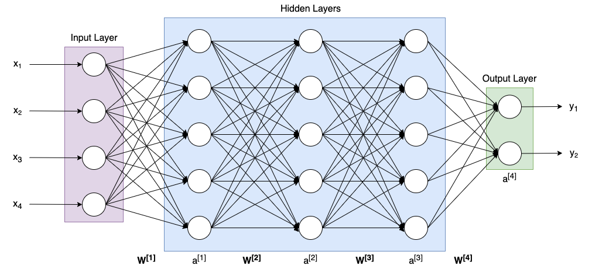

```{r setup, include=FALSE}
knitr::opts_chunk$set(echo = TRUE)
```

# 2. What is Keras?

**Keras** is a Python API for deep learning. It serves as a interface to **Tensorflow**,
and provides an user-friendly syntax and standardized neural net components to allow for
fast and easy model development and experimentation.

**Tensorflow** is a powerful framework developed by Google for performing operations on *tensors*, 
represented with *computational graphs*. This framework is most famously and commonly used for
implementing neural networks.

The *R keras* package provides an interface to the *Python keras* package.
When you run keras in R, it requires starting up a Python environment in
the background, where actual computations are done.


# 3. Neural Networks

**Artificial neural networks** (ANNs) are computational models conceptually 
similar and often analogized to a brain. Basic building blocks are nodes ("neurons"),
connected with links ("synapses"). A basic neural network consists of 
an *input layer* of $n_x$ nodes, some number $L$ of *hidden layers* with $n_h^{[l]}$
nodes in the $l^{th}$ layer, and an *output layer* with $n_y$ nodes. Commonly,
$n_y$ can be 1 node (regression), 2 nodes (binary classification), or multiple
nodes (multi-class classification). There are more complex ANN architectures
that can output text, images, and sounds.

{width=90%}

In a basic feed-forward neural network, each hidden layer has a matrix
of *weights* $W^{[l]}$ of dimension $(n_h^{[l]}, n_h^{[l-1]})$ and *biases* $b^{[l]}$
of dimension $(n_h^{[l]}, 1)$. In the first hidden layer, the second dimension
is $n_x$, matching the input vector. At each layer, we compute:

$$z^{[l]} = W^{[l]}a^{[l-1]} + b^{[l]}$$

where $a^{[l-1]}$ is the output of the *activation functions* from the previous layer,
or in the case of $a^{[0]}$, the input $x$. 

The layer's activation function, usually denoted as $g$ or $\sigma$, takes $z^{[l]}$
as an input and decides  whether the neuron "fires". Common activation functions include
linear, logistic, tanh, ReLU and RBF. These are often quite simple functions; for example,
the widely used Rectified Linear Unit (ReLU) function is simply $g(z) = max(0, z)$; that is;
the node "fires" when the input value is positive, but otherwise outputs 0.

Briefly, neural networks are trained by passing labeled training data through the 
net and comparing the output prediction $\hat{y}$ to the true $y^*$ by computing a 
cost function *J*. Then, moving backwards through the net adjusting the weights
biases using gradient descent, a process called *backpropagation*. 

This is a very high-level overview of the key concepts of ANNs, with many important 
topics not covered, such as connectedness, pruning, dropout, normalization, learning rate,
momentum, pooling, and many more!

Neural networks can also be extended to accomplish different tasks. Some common complex
ANN architectures include:

* Convolutional NNs (CNNs): often used for image applications like object
detection, classification, and machine-generated images
* Recurrent NNs (RNNs): adds additional connections back to previous layers instead
of just forward
* Long-short term memory (LSTM) models: type of RNN that can "remember" previous
dependencies in sequential data, like text or audio data. Capable of very effective
text classification and prediction. For example, given an input like "She went to the
pizzeria for dinner. After sitting down she ordered a ...", a well-trained LSTM model
would remember the mention of "pizzeria" and predict "pizza". Other applications include
machine translation and voice recognition.

They can even be combined; for example, you could design an image captioning model that
takes a picture as input and outputs a descriptive caption, by combining a CNN and LSTM.


# 4. Transfer Learning

**Transfer Learning** is a technique for taking a deep learning model previously trained
on one dataset for some task, and reusing components of that model for a different task.
This is particularly useful when the model has to learn lots of things to be useful for the
task at hand, and you have only a small amount of labelled data for the domain you are applying
the model to.

For example, supposed you want to build an image-classification model that distinguishes
different breeds of dogs, and you have a set of 1000 images - about 10 pictures each of 100
breeds. On its own, this dataset will not be sufficient to train a model from scratch. Before
even getting into the breed differentiation task, your model has to learn to distinguish the subject
from the background, and identify eyes, ears, tails, and the like. 

So if you had the time and money, you could try to expand your dataset, collecting 1000 images
for each breed. Or, you could apply transfer learning by downloading a pre-trained image
classification model and using this as the basis of your model. For example, ResNet50 is a
50-layer CNN pre-trained on over a million images, and is one of many models available directly through
Keras. You can then add any additional layers you need for your specific task, and proceed to train
your model on your small dataset. This allows you to take advantage of previous model training
efforts, and get a head start on your specific task.

This technique is especially useful for language models, where your training dataset is
inevitably a small fraction of the vast range of human literary expression. Before beginning
your text analytics task, it's helpful to have some pre-trained model parameters; a numerical
representation of word relationships, where words with similar meaning are closer together in
a vector space. Some well-known word embeddings include word2vec and GloVe (Global Vectors for
Word Representation). More recent innovations such as BERT (Bidirectional Encoder Representations
from Transformers) allow for the context of surrounding text to inform the representation of a
word's meaning. The details of these models and approaches to training them are beyond the
scope of this tutorial, but they tend to be quite large (millions of parameters), and use immense computational resources
and massive datasets (such as large collections of books or Wikipedia articles). Additionally,
much of the research in this area is quite recent (less than 10 years old), and is an area of
continuous study and improvement. We will see and use a newer model which uses sentence-level
embeddings, the Universal Sentence Encoder, in our final section. 


# 5. Autoencoders

An **autoencoder** is a type of ANN that learns a reduced-dimension representation, or *encoding* of
unlabeled input data. The objective is to transform the input into a sparse, compressed, numerical encoding,
which can then be *decoded* into a reconstruction of the input. 


